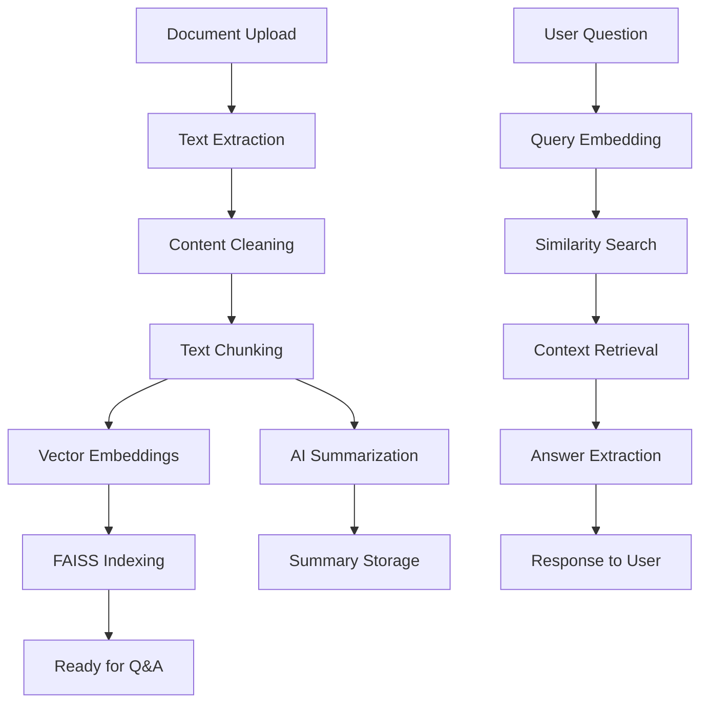

# SmartDocAI 🚀

> **AI-Powered Document Intelligence Platform**  
> Transform your documents into intelligent conversations with cutting-edge AI technology

[](https://smart-doc-ai-brown.vercel.app/)
[](https://huggingface.co/spaces/sachin00110/SmartDocAI)
[](https://github.com/sachinn854/SmartDocAI)

## 🌟 Overview

SmartDocAI is a modern, full-stack document intelligence platform that combines powerful AI capabilities with an intuitive user interface. Upload your documents and unlock the power of AI-driven analysis, summarization, and interactive Q&A.

### ✨ Key Features

- 📄 **Smart Document Processing** - PDF, DOCX, TXT with OCR support
- 🧠 **AI-Powered Summarization** - Intelligent document analysis
- � **Internactive Q&A** - Chat with your documents using RAG
- 🔐 **Secure Authentication** - JWT-based user management
- � **Modenrn UI** - Dark theme with glassmorphism design
- ⚡ **Real-time Processing** - Fast document analysis and responses
- 📱 **Responsive Design** - Works on desktop and mobile

## 🚀 Live Applications

### 🌐 Frontend Application
**URL**: [https://smart-doc-ai-brown.vercel.app/](https://smart-doc-ai-brown.vercel.app/)
- Modern React interface with dark theme
- Real-time document processing
- Interactive dashboard and analytics
- Responsive design for all devices

### 🔗 Backend API
**URL**: [https://huggingface.co/spaces/sachin00110/SmartDocAI](https://huggingface.co/spaces/sachin00110/SmartDocAI)
- FastAPI-powered REST API
- Interactive documentation at `/docs`
- Deployed on Hugging Face Spaces
- Scalable and production-ready

## 🛠️ Tech Stack

### Frontend
- **Framework**: React 18 with modern hooks
- **Styling**: Tailwind CSS with custom animations
- **Routing**: React Router v6
- **State Management**: Context API
- **Deployment**: Vercel

### Backend
- **Framework**: FastAPI with async support
- **ML/AI**: PyTorch + Transformers
- **Embeddings**: Sentence-Transformers
- **Vector Database**: FAISS for semantic search
- **OCR**: Tesseract for image processing
- **Database**: SQLAlchemy + SQLite
- **Authentication**: JWT (python-jose)
- **Deployment**: Hugging Face Spaces

## 🔬 Technical Architecture & Workflow

### 🏗️ System Architecture

```
┌─────────────────┐    ┌─────────────────┐    ┌─────────────────┐
│   Frontend      │    │   Backend API   │    │   AI Services   │
│   (React)       │◄──►│   (FastAPI)     │◄──►│   (ML Models)   │
└─────────────────┘    └─────────────────┘    └─────────────────┘
│                      │                      │
├─ Modern UI           ├─ REST API            ├─ Document Processing
├─ State Management    ├─ Authentication      ├─ AI Summarization  
├─ Real-time Updates   ├─ File Upload         ├─ Vector Embeddings
└─ Responsive Design   └─ Database ORM        └─ Q&A with RAG
```

### 🔄 Document Processing Pipeline

#### Step 1: Document Upload & Extraction
```python
# Supported formats: PDF, DOCX, TXT
Document Upload → Text Extraction → Content Cleaning
```
- **PDF**: `pdfplumber` for text extraction + `pdf2image` + `pytesseract` for OCR
- **DOCX**: `python-docx` for structured text extraction
- **TXT**: Direct UTF-8 text processing
- **Cleaning**: Remove metadata, headers, footers, page numbers

#### Step 2: AI-Powered Summarization
```python
# Hierarchical MAP-REDUCE approach
Text Chunking → Individual Summaries → Merged Summaries
```

**Models Used:**
- **Primary**: `google/flan-t5-small` (60MB, optimized for CPU)
- **Fallback**: `t5-small` (242MB, higher quality)

**Process:**
1. **Text Chunking**: Smart chunking with 150-word chunks, 25-word overlap
2. **MAP Phase**: Each chunk → 3-4 sentence summary using T5
3. **REDUCE Phase**: Merge chunk summaries → Final summaries
4. **Output**: 3 summary types (Short, Medium, Detailed)

#### Step 3: Vector Embeddings & Indexing
```python
# Semantic search preparation
Text Chunks → Embeddings → FAISS Index → Storage
```

**Models Used:**
- **Primary**: `sentence-transformers/all-MiniLM-L6-v2` (80MB, fast)
- **Alternative**: `sentence-transformers/all-mpnet-base-v2` (420MB, high quality)

**Process:**
1. **Chunking**: 300-word chunks with 80-word overlap for context
2. **Embedding**: Convert chunks to 384/768-dimensional vectors
3. **Indexing**: Store in FAISS for fast similarity search
4. **Storage**: Persistent storage in `/data/index/`

#### Step 4: Question Answering (RAG)
```python
# Retrieval-Augmented Generation
Question → Similarity Search → Context Retrieval → Answer Generation
```

**Process:**
1. **Query Embedding**: Convert question to vector using same model
2. **Similarity Search**: FAISS cosine similarity search
3. **Context Retrieval**: Get top-k most relevant chunks
4. **Extractive QA**: Sentence-level extraction from retrieved chunks
5. **Optional LLM**: T5-based answer refinement

### 🧠 AI Models & Performance

| Component | Model | Size | Purpose | Performance |
|-----------|-------|------|---------|-------------|
| **Summarization** | `flan-t5-small` | 60MB | Text summarization | ~2s per document |
| **Embeddings** | `all-MiniLM-L6-v2` | 80MB | Semantic vectors | ~1s per document |
| **Q&A** | `flan-t5-small` | 60MB | Answer generation | ~1s per question |
| **OCR** | `tesseract-ocr` | 50MB | Image text extraction | ~3s per page |

### 📊 Data Flow



### 🔐 Security & Authentication

- **JWT Tokens**: Secure stateless authentication
- **Password Hashing**: bcrypt with salt
- **Rate Limiting**: API endpoint protection
- **CORS**: Configured for secure cross-origin requests
- **Input Validation**: Pydantic schemas for data validation

### 💾 Data Storage

```
/data/
├── uploads/           # User uploaded documents
│   └── {user_id}/
│       └── {doc_id}/
│           ├── original.pdf
│           ├── cleaned.txt
│           └── summaries.json
├── index/             # FAISS vector indexes
│   └── {user_id}/
│       └── {doc_id}/
│           ├── chunks.json
│           └── faiss.index
└── smartdocai.db      # SQLite database
```

## 📖 Quick Start Guide

### 1. Access the Application
Visit [https://smart-doc-ai-brown.vercel.app/](https://smart-doc-ai-brown.vercel.app/) to get started immediately.

### 2. Create Account
```
1. Click "Start Free Trial" on the landing page
2. Fill in your email and password (min 6 chars, avoid common passwords)
3. Click "Create Account"
```

### 3. Upload Documents
```
1. Navigate to Dashboard after login
2. Drag & drop or select PDF/DOCX/TXT files
3. Wait for AI analysis to complete
4. View your document in the sidebar
```

### 4. Interact with Documents
```
1. Click on any document from the sidebar
2. View AI-generated summary
3. Ask questions in the chat interface
4. Get intelligent, context-aware responses
```

## 🔧 API Usage

### Base URLs
- **Frontend**: `https://smart-doc-ai-brown.vercel.app`
- **Backend**: `https://sachin00110-smartdocai.hf.space`

### Authentication Flow
```bash
# 1. Register new user
curl -X POST https://sachin00110-smartdocai.hf.space/auth/signup \
  -H "Content-Type: application/json" \
  -d '{"email": "user@example.com", "password": "securepass123"}'

# 2. Login to get JWT token
curl -X POST https://sachin00110-smartdocai.hf.space/auth/login \
  -H "Content-Type: application/x-www-form-urlencoded" \
  -d 'username=user@example.com&password=securepass123'

# Response: {"access_token": "eyJ...", "token_type": "bearer"}
```

### Document Operations
```bash
# Upload document
curl -X POST https://sachin00110-smartdocai.hf.space/documents/upload \
  -H "Authorization: Bearer YOUR_JWT_TOKEN" \
  -F "file=@document.pdf"

# Summarize document
curl -X POST https://sachin00110-smartdocai.hf.space/summarize/DOC_ID \
  -H "Authorization: Bearer YOUR_JWT_TOKEN"

# Ask questions
curl -X POST https://sachin00110-smartdocai.hf.space/ask/DOC_ID \
  -H "Authorization: Bearer YOUR_JWT_TOKEN" \
  -H "Content-Type: application/json" \
  -d '{"question": "What is this document about?"}'
```

### API Documentation
Interactive API docs available at: [https://sachin00110-smartdocai.hf.space/docs](https://sachin00110-smartdocai.hf.space/docs)

## 🏗️ Local Development

### Prerequisites
- Node.js 16+ and npm/yarn
- Python 3.10+
- Git

### Frontend Setup
```bash
# Clone repository
git clone https://github.com/sachinn854/SmartDocAI.git
cd SmartDocAI/frontend

# Install dependencies
npm install

# Set environment variables
cp .env.example .env
# Edit .env with your backend URL

# Start development server
npm start
```

### Backend Setup
```bash
# Navigate to backend
cd SmartDocAI/backend

# Create virtual environment
python -m venv venv
source venv/bin/activate  # On Windows: venv\Scripts\activate

# Install dependencies
pip install -r requirements.txt

# Set environment variables
cp .env.example .env
# Edit .env with your configuration

# Run development server
uvicorn app.main:app --reload --port 8000
```

## 🎨 UI Features

### Modern Design System
- **Dark Theme**: Elegant dark interface with purple-cyan gradients
- **Glassmorphism**: Modern glass-like effects with backdrop blur
- **Animations**: Smooth transitions and hover effects
- **Typography**: Clean, readable font hierarchy
- **Responsive**: Mobile-first design approach

### User Experience
- **Intuitive Navigation**: Clear routing and breadcrumbs
- **Real-time Feedback**: Loading states and progress indicators
- **Error Handling**: Graceful error messages and recovery
- **Accessibility**: ARIA labels and keyboard navigation

## 🔒 Security Features

- **JWT Authentication**: Secure token-based authentication
- **Password Validation**: Strong password requirements
- **CORS Protection**: Configured for secure cross-origin requests
- **Input Sanitization**: Protection against common attacks
- **Rate Limiting**: API rate limiting for abuse prevention

## 📊 Performance

### Frontend
- **Bundle Size**: Optimized with code splitting
- **Loading Speed**: Fast initial load with lazy loading
- **Caching**: Efficient browser caching strategies
- **CDN**: Deployed on Vercel's global CDN

### Backend
- **Response Time**: < 2s for document processing
- **Throughput**: Handles multiple concurrent requests
- **Memory Usage**: ~500MB base + ~200MB per request
- **Scalability**: Auto-scaling on Hugging Face Spaces

## 🚀 Deployment

### Frontend (Vercel)
```bash
# Deploy to Vercel
npm install -g vercel
vercel --prod
```

### Backend (Hugging Face Spaces)
```bash
# Push to HF Spaces repository
git remote add hf https://huggingface.co/spaces/YOUR_USERNAME/YOUR_SPACE
git push hf main
```

## 🤝 Contributing

We welcome contributions! Please see our [Contributing Guidelines](CONTRIBUTING.md) for details.

### Development Workflow
1. Fork the repository
2. Create a feature branch (`git checkout -b feature/amazing-feature`)
3. Commit your changes (`git commit -m 'Add amazing feature'`)
4. Push to the branch (`git push origin feature/amazing-feature`)
5. Open a Pull Request

## 📝 License

This project is licensed under the MIT License - see the [LICENSE](LICENSE) file for details.

## 🙏 Acknowledgments

- **Hugging Face** for Transformers and Spaces hosting
- **Vercel** for frontend deployment
- **OpenAI** for inspiration in AI interfaces
- **Tailwind CSS** for the amazing styling framework

## 📞 Support

- **Issues**: [GitHub Issues](https://github.com/sachinn854/SmartDocAI/issues)
- **Discussions**: [GitHub Discussions](https://github.com/sachinn854/SmartDocAI/discussions)
- **Email**: [Contact Developer](mailto:your-email@example.com)

---

<div align="center">

**Built with ❤️ by [Sachin](https://github.com/sachinn854)**

[⭐ Star this repo](https://github.com/sachinn854/SmartDocAI) • [🐛 Report Bug](https://github.com/sachinn854/SmartDocAI/issues) • [💡 Request Feature](https://github.com/sachinn854/SmartDocAI/issues)

</div>